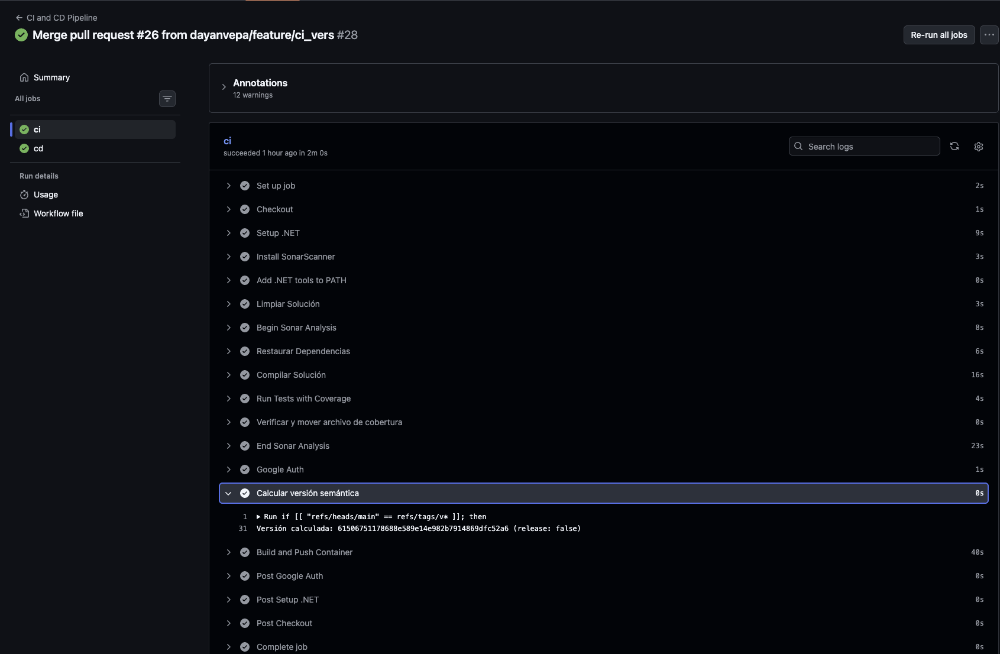
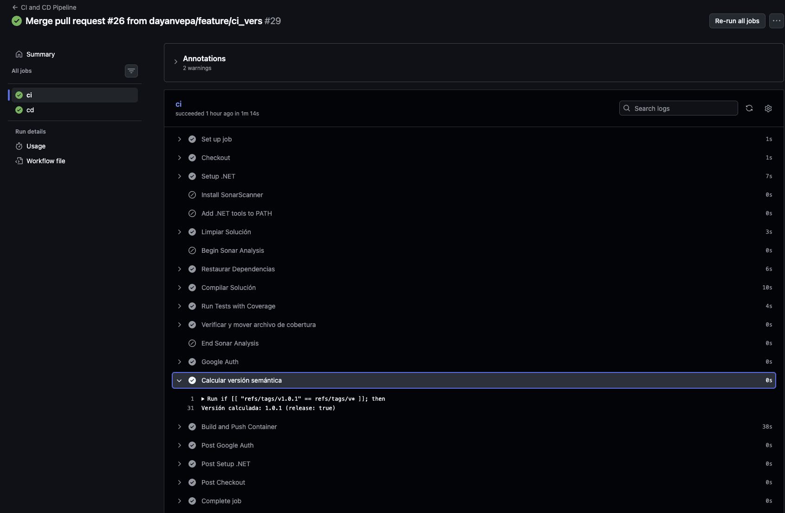
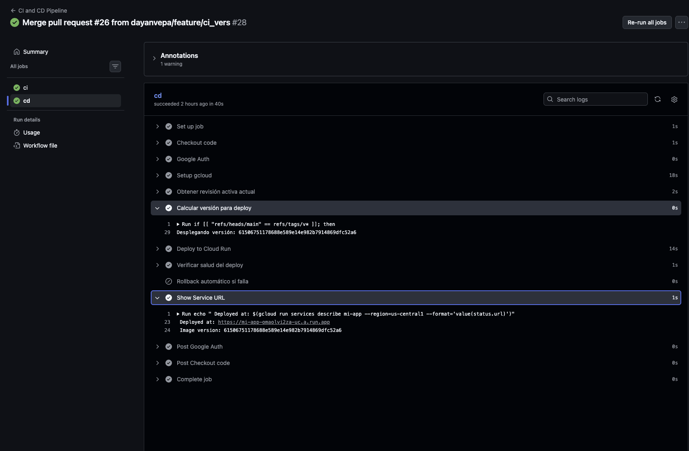
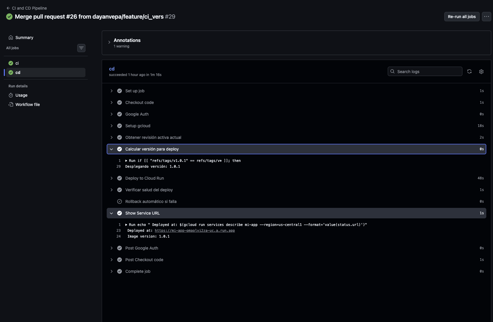
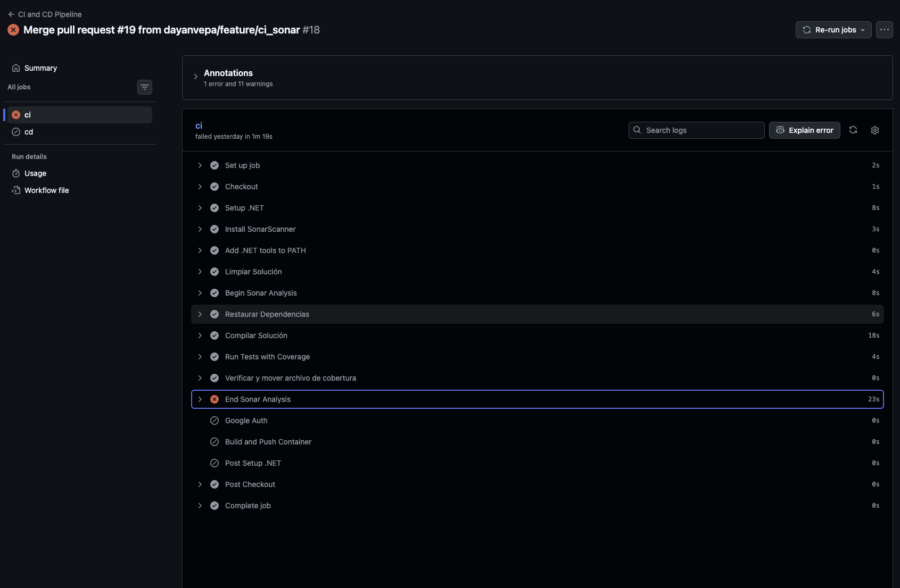

#  ServiceDemo — CI/CD Pipeline

<div align="center">


[](https://sonarcloud.io/summary/new_code?id=dayanvepa_ServiceDemo)
[](https://sonarcloud.io/summary/new_code?id=dayanvepa_ServiceDemo)
[](https://sonarcloud.io/summary/new_code?id=dayanvepa_ServiceDemo)
[](https://sonarcloud.io/summary/new_code?id=dayanvepa_ServiceDemo)
[](https://sonarcloud.io/summary/new_code?id=dayanvepa_ServiceDemo)

**API REST construida con .NET 9, desplegada automáticamente en Google Cloud Run mediante GitHub Actions.**

[🌐 Ver API en producción](https://mi-app-802338067803.us-central1.run.app/scalar/v1) · [📊 Ver en SonarCloud](https://sonarcloud.io/summary/new_code?id=dayanvepa_ServiceDemo)

</div>

---
## Integrantes del Equipo

| Nombre | GitHub |
|---|---|
| **Dayan Velasquez Parrado** | [@dayanvepa](https://github.com/dayanvepa) |
| **Anuar Edilson Vargas Calderon** |  [@anuarvargascal](https://github.com/anuarvargascal) |

---

##  Tabla de Contenidos

- [Descripción general](#-descripción-general)
- [Arquitectura del proyecto](#-arquitectura-del-proyecto)
- [Tecnologías utilizadas](#-tecnologías-utilizadas)
- [Flujo del pipeline CI/CD](#-flujo-del-pipeline-cicd)
- [Pipeline CI — Paso a paso](#-pipeline-ci--paso-a-paso)
- [Pipeline CD — Paso a paso](#-pipeline-cd--paso-a-paso)
- [Versionado Semántico](#️-versionado-semántico)
- [Rollback Automático](#-rollback-automático)
- [Prerrequisitos en GCP](#-prerrequisitos-en-gcp)
- [Configuración de GitHub Secrets y Variables](#-configuración-de-github-secrets-y-variables)
- [Dockerfile](#-dockerfile)
- [Análisis de calidad con SonarCloud](#-análisis-de-calidad-con-sonarcloud)
- [Seguridad del pipeline](#-seguridad-del-pipeline)
- [Endpoints del servicio](#-endpoints-del-servicio)
- [Comandos útiles](#-comandos-útiles)

---

##  Descripción general

**ServiceDemo** es una API REST desarrollada con **.NET 9** que implementa un flujo completo de **DevOps** con:

-  Integración continua con análisis de calidad y cobertura de código
-  Despliegue continuo en **Google Cloud Run**
-  Versionado semántico mediante tags Git (`vX.Y.Z`)
-  Rollback automático ante fallos en el Health Check
-  Autenticación segura con **Workload Identity Federation** (sin llaves JSON)
-  Gestión de secretos con **Google Secret Manager**
-  Imágenes Docker almacenadas en **Artifact Registry**

---

##  Arquitectura del proyecto

```text
ServiceDemo/
├── .github/
│   └── workflows/
│       └── ci-cd.yaml              # Pipeline CI/CD completo
├── src/
│   ├── ServiceDemo.API/            # Controllers, Middleware, Program.cs
│   ├── ServiceDemo.Application/    # Services, Validators, DTOs, Mappings
│   ├── ServiceDemo.Domain/         # Entidades, Interfaces, Excepciones
│   └── ServiceDemo.Infrastructure/ # Repositorios, DbContext, UnitOfWork
├── tests/
│   └── ServiceDemo.Tests/          # Pruebas unitarias (xUnit)
├── Dockerfile                      # Multi-stage build
└── ServiceDemo.slnx                # Archivo de solución .NET
```

### Capas de la arquitectura

| Capa | Proyecto | Responsabilidad |
|---|---|---|
| **API** | `ServiceDemo.API` | Exposición de endpoints REST, middleware, configuración |
| **Application** | `ServiceDemo.Application` | Lógica de negocio, validaciones, DTOs, AutoMapper |
| **Domain** | `ServiceDemo.Domain` | Entidades, interfaces de repositorios, excepciones |
| **Infrastructure** | `ServiceDemo.Infrastructure` | Implementación de repositorios, EF Core, UnitOfWork |

---

##  Tecnologías utilizadas

### Backend
| Tecnología | Versión | Uso |
|---|---|---|
| .NET / ASP.NET Core | 9.0 | Framework principal |
| Entity Framework Core | Latest | ORM para acceso a datos |
| FluentValidation | Latest | Validación de modelos |
| AutoMapper | Latest | Mapeo entre capas |
| Scalar | Latest | Documentación interactiva de la API |

### DevOps y Calidad
| Tecnología | Uso |
|---|---|
| GitHub Actions | Orquestación del pipeline CI/CD |
| SonarCloud | Análisis estático, cobertura y Quality Gate |
| xUnit | Framework de pruebas unitarias |
| Docker | Contenedorización de la aplicación |

### Google Cloud Platform
| Servicio | Uso |
|---|---|
| Cloud Run | Hosting serverless de contenedores |
| Artifact Registry | Repositorio de imágenes Docker |
| Secret Manager | Gestión segura de secretos |
| Workload Identity Federation | Autenticación keyless desde GitHub |
| IAM | Control de acceso y permisos |

---

## 🔄 Flujo del pipeline CI/CD

```text
  EVENTO GITHUB                JOBS
 ───────────────         ─────────────────────────────────────────
 [Pull Request]  ───▶ [CI: Build + Test + Sonar]
 [Push main]     ───▶ [CI]
                         ├── 1. Checkout del código
                         ├── 2. Setup .NET 9
                         ├── 3. Instalar SonarScanner ✅
                         ├── 4. Limpiar solución
                         ├── 5. Begin Sonar Analysis ✅
                         ├── 6. Restaurar dependencias
                         ├── 7. Compilar solución
                         ├── 8. Ejecutar tests + cobertura
                         ├── 9. Mover archivo de cobertura
                         ├── 10. End Sonar Analysis ✅
                         ├── 11. Google Auth (WIF)
                         ├── 12. Calcular versión (SHA)
                         └── 13. Docker Build + Push (SHA)
                                  │
                                  ▼
                              [CD]
                                  ├── 1. Checkout
                                  ├── 2. Google Auth (WIF)
                                  ├── 3. Setup gcloud CLI
                                  ├── 4. Capturar revisión activa
                                  ├── 5. Calcular versión (SHA)
                                  ├── 6. Deploy a Cloud Run
                                  ├── 7. Health Check (5 intentos)
                                  ├── 8. Rollback si falla ⚠️
                                  └── 9. Mostrar URL del servicio

 [Push v1.0.0]   ───▶ [CI]
                         ├── 1. Checkout del código
                         ├── 2. Setup .NET 9
                         ├── 3. (SonarScanner omitido en tags) ⏭️
                         ├── 4. Limpiar solución
                         ├── 5. (Sonar omitido en tags) ⏭️
                         ├── 6. Restaurar dependencias
                         ├── 7. Compilar solución
                         ├── 8. Ejecutar tests + cobertura
                         ├── 9. Mover archivo de cobertura
                         ├── 10. (Sonar omitido en tags) ⏭️
                         ├── 11. Google Auth (WIF)
                         ├── 12. Calcular versión (1.0.0)
                         └── 13. Docker Build + Push (1.0.0 & latest)
                                  │
                                  ▼
                              [CD]
                                  ├── 1. Checkout
                                  ├── 2. Google Auth (WIF)
                                  ├── 3. Setup gcloud CLI
                                  ├── 4. Capturar revisión activa
                                  ├── 5. Calcular versión (1.0.0)
                                  ├── 6. Deploy a Cloud Run
                                  ├── 7. Health Check (5 intentos)
                                  ├── 8. Rollback si falla ⚠️
                                  └── 9. Mostrar URL del servicio
```

---

## Pipeline CI — Paso a paso

El job `ci` corre en `ubuntu-latest` y se activa en cada `push` a `main` o al crear un tag `v*.*.*`.

### Paso 1 — Checkout del código

```yaml
- name: Checkout
  uses: actions/checkout@v4
  with:
    fetch-depth: 0
```

Descarga el repositorio completo con todo el historial de commits.
El parámetro `fetch-depth: 0` es **obligatorio** para SonarCloud, ya que necesita el historial completo para calcular métricas de nuevas líneas vs. código existente.

---

### Paso 2 — Setup .NET 9

```yaml
- name: Setup .NET
  uses: actions/setup-dotnet@v4
  with:
    dotnet-version: 9.0.x
```

Instala el SDK de .NET 9 en el runner de GitHub Actions.

---

### Paso 3 — Instalar SonarScanner *(omitido en tags)*

```yaml
- name: Install SonarScanner
  if: ${{ !startsWith(github.ref, 'refs/tags/') }}
  run: dotnet tool install --global dotnet-sonarscanner

- name: Add .NET tools to PATH
  if: ${{ !startsWith(github.ref, 'refs/tags/') }}
  run: echo "$HOME/.dotnet/tools" >> $GITHUB_PATH
```

Instala la herramienta `dotnet-sonarscanner` globalmente y la agrega al `PATH` del sistema.

>  **Este paso se omite cuando el evento es un tag** (`refs/tags/v*`). En una release, la calidad ya fue validada en la rama `main`.

---

### Paso 4 — Limpiar solución

```yaml
- name: Limpiar Solución
  run: dotnet clean ServiceDemo.slnx --configuration Release
```

Elimina los artefactos de compilaciones anteriores para garantizar un build limpio.

---

### Paso 5 — Begin Sonar Analysis *(omitido en tags)*

```yaml
- name: Begin Sonar Analysis
  if: ${{ !startsWith(github.ref, 'refs/tags/') }}
  run: |
    dotnet sonarscanner begin       /k:"${{ env.SONAR_PROJECT_KEY }}"       /o:"${{ env.SONAR_ORGANIZATION }}"       /d:sonar.token="${{ env.SONAR_TOKEN }}"       /d:sonar.host.url="https://sonarcloud.io"       /d:sonar.qualitygate.wait=true       /d:sonar.cs.opencover.reportsPaths="./TestResults/coverage/coverage.opencover.xml"       /d:sonar.exclusions="**/Migrations/**,**/obj/**,**/bin/**,**/Program.cs,**/DependencyInjection.cs,src/ServiceDemo.Domain/**,src/ServiceDemo.Infrastructure/Data/ServiceDemoDbContext.cs,src/ServiceDemo.Application/Mappings/**"       /d:sonar.coverage.exclusions="**/Program.cs,**/DependencyInjection.cs,src/ServiceDemo.Domain/**,src/ServiceDemo.Infrastructure/**,src/ServiceDemo.API/Middleware/**,src/ServiceDemo.Application/Validators/**,src/ServiceDemo.Application/Common/**"
```

Inicia el análisis de SonarCloud. A partir de este punto, SonarScanner intercepta la compilación y las pruebas para recolectar métricas.

| Parámetro | Descripción |
|---|---|
| `sonar.qualitygate.wait=true` | El pipeline falla si no se supera el Quality Gate |
| `sonar.exclusions` | Archivos excluidos completamente del análisis |
| `sonar.coverage.exclusions` | Archivos excluidos solo del cálculo de cobertura |

---

### Paso 6 — Restaurar dependencias

```yaml
- name: Restaurar Dependencias
  run: dotnet restore ServiceDemo.slnx
```

Descarga todos los paquetes NuGet definidos en los proyectos de la solución.

---

### Paso 7 — Compilar solución

```yaml
- name: Compilar Solución
  run: dotnet build ServiceDemo.slnx --no-restore --configuration Release
```

Compila todos los proyectos en modo `Release`. El flag `--no-restore` evita una restauración redundante.

---

### Paso 8 — Ejecutar pruebas con cobertura

```yaml
- name: Run Tests with Coverage
  run: |
    dotnet test ServiceDemo.slnx       --no-build       --configuration Release       --collect:"XPlat Code Coverage"       --results-directory ./TestResults       -- DataCollectionRunSettings.DataCollectors.DataCollector.Configuration.Format=opencover
```

Ejecuta todas las pruebas unitarias y recolecta la cobertura de código en formato **OpenCover** (`.xml`), que es el formato requerido por SonarCloud.

---

### Paso 9 — Mover archivo de cobertura

```yaml
- name: Verificar y mover archivo de cobertura
  run: |
    mkdir -p ./TestResults/coverage
    find ./TestResults -name "coverage.opencover.xml"       -exec cp {} ./TestResults/coverage/coverage.opencover.xml \;
```

`dotnet test` genera el archivo de cobertura en una subcarpeta con GUID aleatorio. Este paso lo mueve a la ruta fija `./TestResults/coverage/coverage.opencover.xml` que SonarCloud espera encontrar.

---

### Paso 10 — End Sonar Analysis *(omitido en tags)*

```yaml
- name: End Sonar Analysis
  if: ${{ !startsWith(github.ref, 'refs/tags/') }}
  run: dotnet sonarscanner end /d:sonar.token="${{ env.SONAR_TOKEN }}"
```

Finaliza el análisis y envía todos los datos recolectados a SonarCloud. Si el **Quality Gate** no se supera, el pipeline se detiene aquí con error.

---

### Paso 11 — Google Auth (WIF)

```yaml
- name: Google Auth
  if: github.event_name == 'push'
  uses: google-github-actions/auth@v2
  with:
    workload_identity_provider: ${{ secrets.WIF_PROVIDER }}
    service_account: ${{ secrets.WIF_SERVICE_ACCOUNT }}
```

Autentica el runner con Google Cloud usando **Workload Identity Federation**. No se usan llaves JSON. GitHub emite un token OIDC que GCP valida para otorgar acceso temporal al Service Account.

>  **Este paso se omite en Pull Requests** (`github.event_name == 'push'`). No se publican imágenes desde PRs.

---

### Paso 12 — Calcular versión semántica

```yaml
- name: Calcular versión semántica
  if: github.event_name == 'push'
  id: version
  run: |
    if [[ "${{ github.ref }}" == refs/tags/v* ]]; then
      VERSION="${{ github.ref_name }}"
      VERSION="${VERSION#v}"   # Elimina el prefijo "v" → "1.0.0"
      IS_RELEASE="true"
    else
      VERSION="${{ github.sha }}"
      IS_RELEASE="false"
    fi
    echo "version=$VERSION" >> $GITHUB_OUTPUT
    echo "is_release=$IS_RELEASE" >> $GITHUB_OUTPUT
```

Determina qué tag usar para la imagen Docker:

| Evento | Versión calculada | `IS_RELEASE` |
|---|---|---|
| `push` a `main` | SHA del commit (ej. `9f4c2a3...`) | `false` |
| `push` de tag `v1.2.0` | `1.2.0` | `true` |

---

### Paso 13 — Build y Push de imagen Docker

```yaml
- name: Build and Push Container
  if: github.event_name == 'push'
  run: |
    BASE_URL="${{ env.REGION }}-docker.pkg.dev/${{ env.PROJECT_ID }}/${{ env.REPOSITORY }}/${{ env.SERVICE_NAME }}"
    VERSION="${{ steps.version.outputs.version }}"
    IS_RELEASE="${{ steps.version.outputs.is_release }}"

    gcloud auth configure-docker ${{ env.REGION }}-docker.pkg.dev

    docker build -t $BASE_URL:$VERSION .
    docker push $BASE_URL:$VERSION

    if [ "$IS_RELEASE" = "true" ]; then
      docker tag $BASE_URL:$VERSION $BASE_URL:latest
      docker push $BASE_URL:latest
    fi
```

Construye la imagen Docker usando el `Dockerfile` del repositorio y la publica en **Artifact Registry**.

| Escenario | Imágenes publicadas |
|---|---|
| Push a `main` | `mi-app:9f4c2a3...` |
| Tag `v1.2.0` | `mi-app:1.2.0` + `mi-app:latest` |

---

###  Evidencia — CI pull request a `main`

<div align="center">
  
</div>

---

###  Evidencia — CI push a `main`

<div align="center">
  
</div>

---

###  Evidencia — CI push de tag `v*.*.*`

<div align="center">
  
</div>

---

##  Pipeline CD — Paso a paso

El job `cd` depende del éxito del job `ci` y solo se ejecuta en `push` a `main` o al crear un tag `v*.*.*`.

```yaml
cd:
  needs: ci
  if: github.event_name == 'push' &&
      (github.ref == 'refs/heads/main' || startsWith(github.ref, 'refs/tags/v'))
```

---

### Paso 1 — Checkout

```yaml
- name: Checkout code
  uses: actions/checkout@v4
```

Descarga el código del repositorio. Necesario para que `gcloud` tenga acceso al contexto del proyecto.

---

### Paso 2 — Google Auth (WIF)

```yaml
- name: Google Auth
  uses: google-github-actions/auth@v2
  with:
    workload_identity_provider: ${{ secrets.WIF_PROVIDER }}
    service_account: ${{ secrets.WIF_SERVICE_ACCOUNT }}
```

Autentica nuevamente con GCP usando Workload Identity Federation para que los comandos `gcloud` del job `cd` tengan permisos de despliegue.

---

### Paso 3 — Setup gcloud CLI

```yaml
- name: Setup gcloud
  uses: google-github-actions/setup-gcloud@v2
```

Instala y configura la CLI de Google Cloud (`gcloud`) en el runner para poder ejecutar comandos de Cloud Run.

---

### Paso 4 — Capturar revisión activa (para rollback)

```yaml
- name: Obtener revisión activa actual
  id: current_revision
  run: |
    REVISION=$(gcloud run services describe ${{ env.SERVICE_NAME }}       --region=${{ env.REGION }}       --format="value(status.traffic[0].revisionName)" 2>/dev/null || echo "")
    echo "revision=$REVISION" >> $GITHUB_OUTPUT
```

Antes de desplegar, guarda el nombre de la revisión activa actual de Cloud Run. Este valor se usa como punto de restauración si el nuevo despliegue falla.

---

### Paso 5 — Calcular versión para deploy

```yaml
- name: Calcular versión para deploy
  id: version
  run: |
    if [[ "${{ github.ref }}" == refs/tags/v* ]]; then
      VERSION="${{ github.ref_name }}"
      VERSION="${VERSION#v}"
    else
      VERSION="${{ github.sha }}"
    fi
    echo "version=$VERSION" >> $GITHUB_OUTPUT
```

Recalcula la misma versión que usó el job `ci` para identificar la imagen correcta en Artifact Registry.

---

### Paso 6 — Deploy a Cloud Run

```yaml
- name: Deploy to Cloud Run
  id: deploy
  uses: google-github-actions/deploy-cloudrun@v2
  with:
    service: ${{ env.SERVICE_NAME }}
    region: ${{ env.REGION }}
    image: "${{ env.REGION }}-docker.pkg.dev/${{ env.PROJECT_ID }}/${{ env.REPOSITORY }}/${{ env.SERVICE_NAME }}:${{ steps.version.outputs.version }}"
    flags: '--allow-unauthenticated'
    secrets: |
      ConnectionStrings__DefaultConnection=connection-string:latest
```

Despliega la imagen en Cloud Run con las siguientes configuraciones:

| Parámetro | Valor | Descripción |
|---|---|---|
| `service` | `mi-app` | Nombre del servicio en Cloud Run |
| `region` | `us-central1` | Región de despliegue |
| `image` | `...mi-app:VERSION` | Imagen publicada en el paso anterior |
| `--allow-unauthenticated` | flag | Permite acceso público al servicio |
| `secrets` | `connection-string:latest` | Inyecta la cadena de conexión desde Secret Manager |

---

### Paso 7 — Health Check (verificación de salud)

```yaml
- name: Verificar salud del deploy
  id: health_check
  run: |
    SERVICE_URL=$(gcloud run services describe ${{ env.SERVICE_NAME }}       --region=${{ env.REGION }}       --format="value(status.url)")

    for i in {1..5}; do
      STATUS=$(curl -s -o /dev/null -w "%{http_code}" "$SERVICE_URL/health" || echo "000")
      echo "Intento $i — HTTP $STATUS"
      if [ "$STATUS" = "200" ]; then
        exit 0
      fi
      sleep 10
    done
    exit 1
```

Después del despliegue, verifica que el servicio esté respondiendo correctamente:

1. Obtiene la URL pública del servicio en Cloud Run.
2. Realiza hasta **5 intentos** de `GET /health`.
3. Espera **10 segundos** entre cada intento.
4. Si algún intento retorna `HTTP 200` → el pipeline continúa con éxito ✅.
5. Si los 5 intentos fallan → el pipeline falla y se activa el rollback ❌.

---

### Paso 8 — Rollback automático *(solo si falla)*

```yaml
- name: Rollback automático si falla
  if: failure() && steps.current_revision.outputs.revision != ''
  run: |
    PREV_REVISION="${{ steps.current_revision.outputs.revision }}"
    gcloud run services update-traffic ${{ env.SERVICE_NAME }}       --region=${{ env.REGION }}       --to-revisions=$PREV_REVISION=100
```

Este paso **solo se ejecuta si el paso anterior falló** y si existe una revisión previa guardada.

Redirige el 100% del tráfico de Cloud Run a la revisión estable anterior, restaurando el servicio automáticamente sin intervención manual.

---

### Paso 9 — Mostrar URL del servicio

```yaml
- name: Show Service URL
  run: |
    echo "Deployed at: $(gcloud run services describe ${{ env.SERVICE_NAME }}       --region=${{ env.REGION }} --format='value(status.url)')"
    echo "Image version: ${{ steps.version.outputs.version }}"
```

Imprime en los logs del pipeline la URL pública del servicio desplegado y la versión de la imagen utilizada.

---


###  Evidencia — CD push a `main`

<div align="center">
  
</div>

---

###  Evidencia — CD push de tag `v*.*.*`

<div align="center">
  
</div>

---

##  Versionado Semántico

| Evento | Versión de imagen | Tag `latest` | SonarCloud |
|---|---|---|---|
| `push` a `main` | SHA del commit | ❌ | ✅ |
| `git push origin v1.0.0` | `1.0.0` | ✅ | ❌ |

```bash
# Crear y publicar una nueva versión
git tag v1.0.0
git push origin v1.0.0
```

---

## 🔄 Rollback Automático

```text
[Deploy a Cloud Run]
        │
        ▼
[Health Check GET /health]
        │
   ┌────┴────┐
   │         │
  200       Falla (5 intentos)
   │         │
   ▼         ▼
[Éxito]  [Rollback → revisión anterior]
```

---

##  Prerrequisitos en GCP

### 1. Habilitar servicios necesarios

```bash
gcloud services enable run.googleapis.com
gcloud services enable artifactregistry.googleapis.com
gcloud services enable iam.googleapis.com
gcloud services enable iamcredentials.googleapis.com
gcloud services enable secretmanager.googleapis.com
```

### 2. Crear el Service Account

```bash
gcloud iam service-accounts create github-actions-sa \
  --display-name="GitHub Actions SA" \
  --project=cicd-net-498818
```

### 3. Asignar roles al Service Account

```bash
gcloud projects add-iam-policy-binding cicd-net-498818 \
  --member="serviceAccount:github-actions-sa@cicd-net-498818.iam.gserviceaccount.com" \
  --role="roles/run.admin"

gcloud projects add-iam-policy-binding cicd-net-498818 \
  --member="serviceAccount:github-actions-sa@cicd-net-498818.iam.gserviceaccount.com" \
  --role="roles/artifactregistry.writer"

gcloud projects add-iam-policy-binding cicd-net-498818 \
  --member="serviceAccount:github-actions-sa@cicd-net-498818.iam.gserviceaccount.com" \
  --role="roles/iam.serviceAccountUser"
```

### 4. Configurar Workload Identity Federation

```bash
# Crear el pool
gcloud iam workload-identity-pools create "github-pool" \
  --project="cicd-net-498818" \
  --location="global" \
  --display-name="GitHub Pool"

# Crear el provider OIDC
gcloud iam workload-identity-pools providers create-oidc "github-provider" \
  --project="cicd-net-498818" \
  --location="global" \
  --workload-identity-pool="github-pool" \
  --attribute-mapping="google.subject=assertion.sub,attribute.repository=assertion.repository,attribute.actor=assertion.actor" \
  --issuer-uri="https://token.actions.githubusercontent.com" \
  --attribute-condition="assertion.repository=='dayanvepa/ServiceDemo'"

# Vincular el Service Account al pool
gcloud iam service-accounts add-iam-policy-binding \
  github-actions-sa@cicd-net-498818.iam.gserviceaccount.com \
  --project="cicd-net-498818" \
  --role="roles/iam.workloadIdentityUser" \
  --member="principalSet://iam.googleapis.com/projects/802338067803/locations/global/workloadIdentityPools/github-pool/attribute.repository/dayanvepa/ServiceDemo"
```

### 5. Crear repositorio en Artifact Registry

```bash
gcloud artifacts repositories create mi-app \
  --repository-format=docker \
  --location=us-central1 \
  --description="Docker images for ServiceDemo"
```

### 6. Crear el secret de la cadena de conexión

```bash
echo -n "Server=tcp:<servidor>;Initial Catalog=<db>;..." | \
  gcloud secrets create connection-string --data-file=-
```

### 7. Obtener el valor de WIF_PROVIDER

```bash
gcloud iam workload-identity-pools providers describe github-provider \
  --project="cicd-net-498818" \
  --location="global" \
  --workload-identity-pool="github-pool" \
  --format="value(name)"
```

---

##  Configuración de GitHub Secrets y Variables

Ve a tu repositorio → **Settings → Secrets and variables → Actions**

### Secrets

| Nombre | Descripción |
|---|---|
| `GCP_PROJECT_ID` | ID del proyecto GCP (`cicd-net-498818`) |
| `WIF_PROVIDER` | Ruta completa del Workload Identity Provider |
| `WIF_SERVICE_ACCOUNT` | Email del service account |
| `SONAR_TOKEN` | Token de autenticación de SonarCloud |

### Variables

| Nombre | Descripción |
|---|---|
| `SONAR_PROJECT_KEY` | Clave del proyecto en SonarCloud |
| `SONAR_ORGANIZATION` | Nombre de la organización en SonarCloud |

---

##  Dockerfile

El proyecto usa un **multi-stage build** para optimizar el tamaño de la imagen final:

| Etapa | Imagen base | Tamaño aproximado |
|---|---|---|
| Build | `dotnet/sdk:9.0` | ~900 MB |
| Runtime (final) | `dotnet/aspnet:9.0` | ~220 MB |

>  Cloud Run requiere que la aplicación escuche en el puerto `8080`.

---

##  Análisis de calidad con SonarCloud

### Exclusiones configuradas

| Patrón | Tipo | Razón |
|---|---|---|
| `**/Migrations/**` | `sonar.exclusions` | Código generado por EF Core |
| `**/obj/**`, `**/bin/**` | `sonar.exclusions` | Artefactos de compilación |
| `**/Program.cs` | Ambos | Sin lógica de negocio |
| `**/DependencyInjection.cs` | Ambos | Solo registro de servicios |
| `src/ServiceDemo.Domain/**` | Ambos | POCOs sin lógica |
| `src/ServiceDemo.Infrastructure/**` | `sonar.coverage.exclusions` | Requiere DB real |

>  SonarCloud se ejecuta en `push` a ramas. Se omite en tags de release (`v*.*.*`).

---

###  Evidencia — Fallo en Escaneo de Calidad Estática

<div align="center">
  
</div>

>  El pipeline se detiene automáticamente si no se cumple con el mínimo de cobertura (80%) o si existen vulnerabilidades críticas para el ccodigo nuevo.
---

##  Seguridad del pipeline

### Workload Identity Federation (Keyless Auth)

```text
GitHub Actions emite token OIDC
         │
         ▼
GCP valida que el token viene de dayanvepa/ServiceDemo
         │
         ▼
GCP otorga acceso temporal al Service Account
         │
         ▼
Pipeline ejecuta gcloud / docker sin credenciales estáticas
```

---

##  Endpoints del servicio

| Endpoint | Descripción |
|---|---|
| `/scalar/v1` | Documentación interactiva (Scalar UI) |
| `/health` | Health check del servicio (usado por el pipeline CD) |

**URL base del servicio desplegado:**
```
https://mi-app-802338067803.us-central1.run.app
```

---


<div align="center">

Desarrollado con usando .NET 9, GitHub Actions y Google Cloud Platform

</div>
