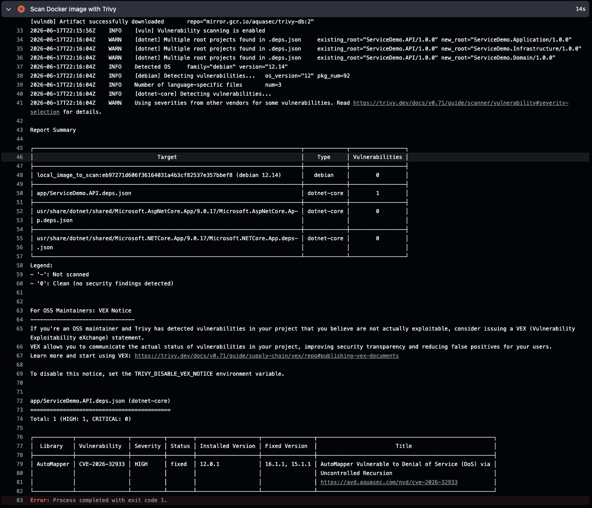
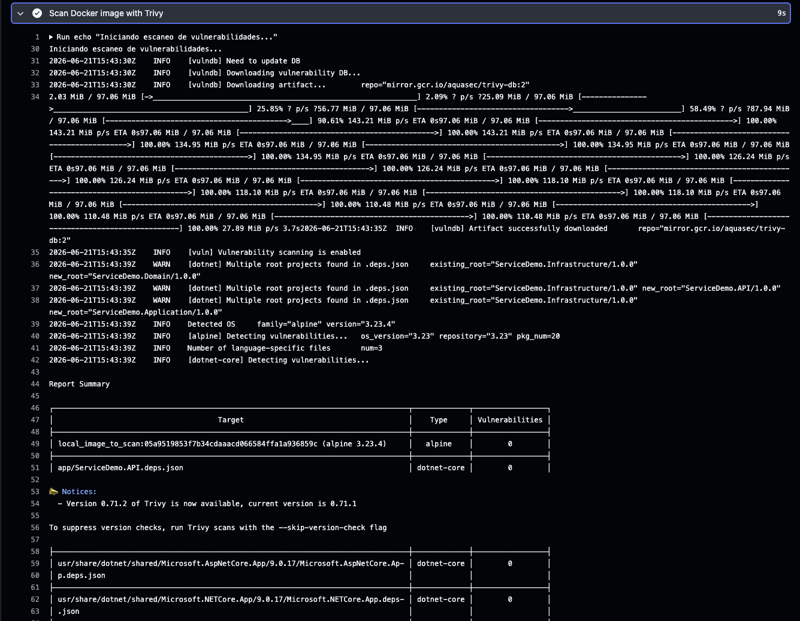
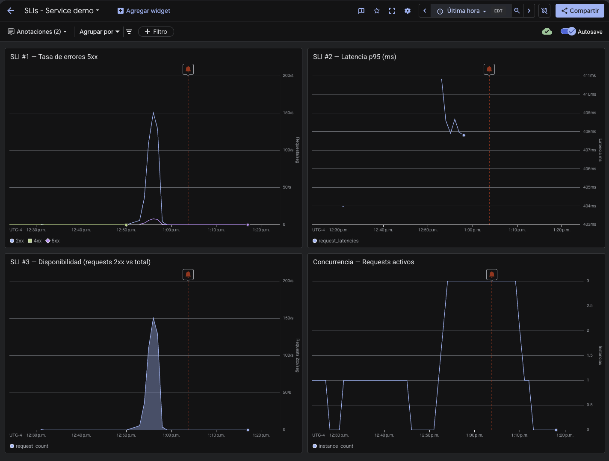
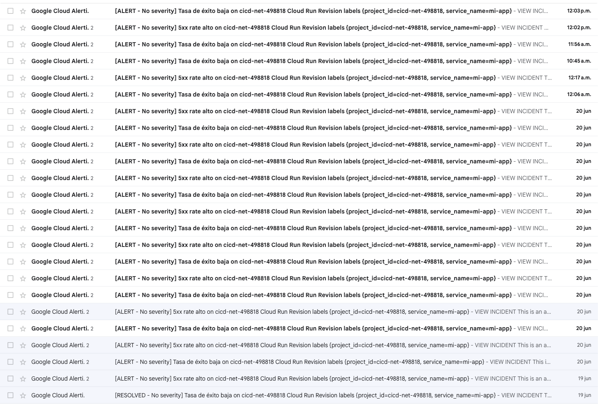
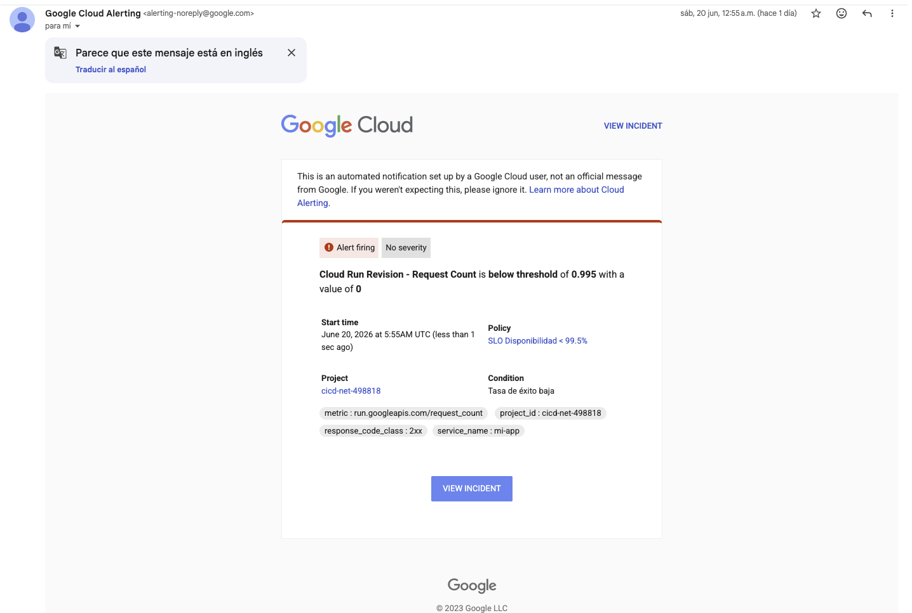
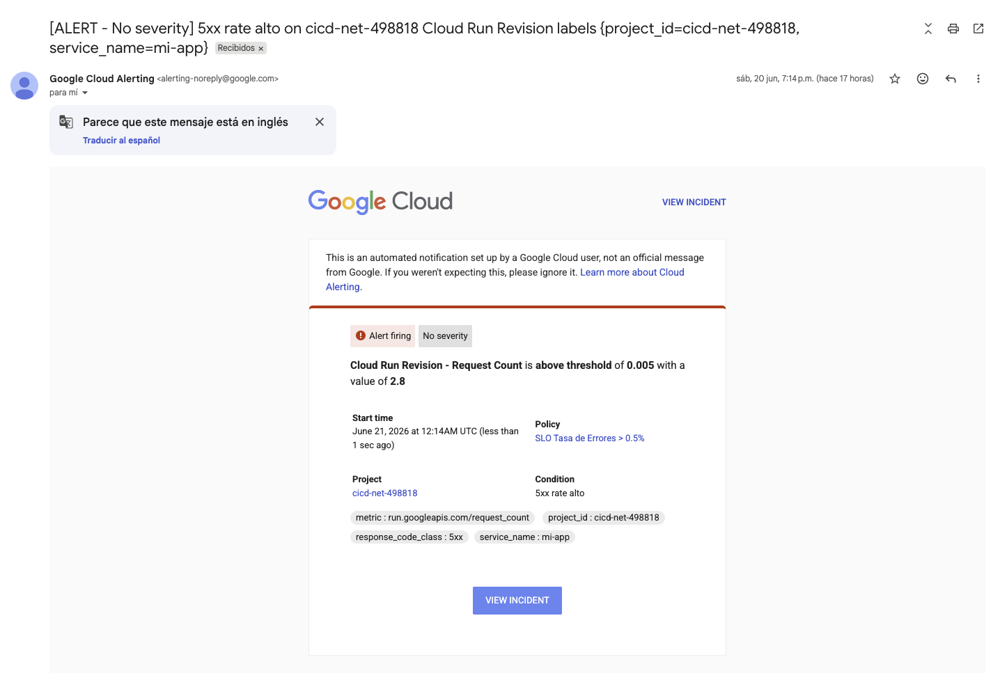
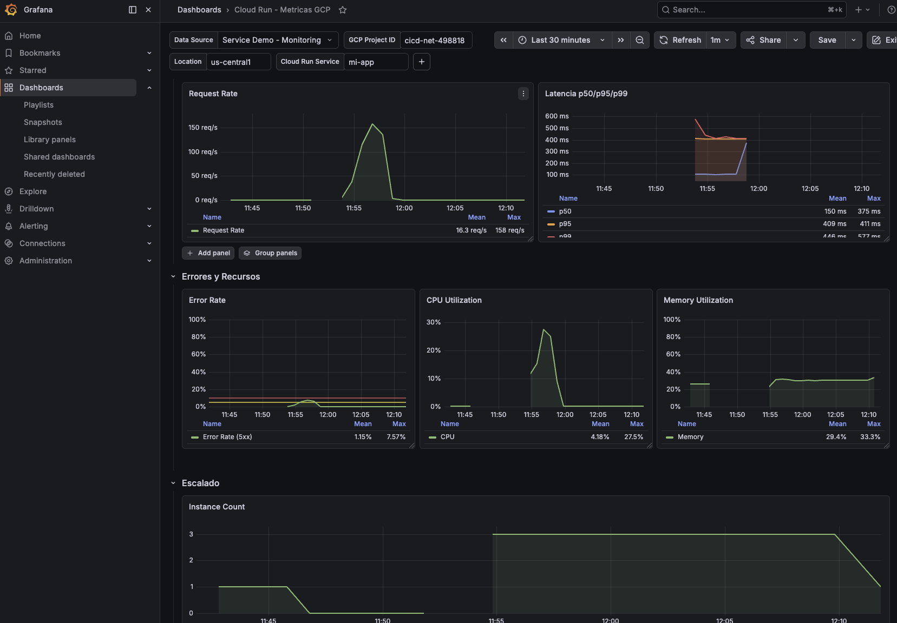
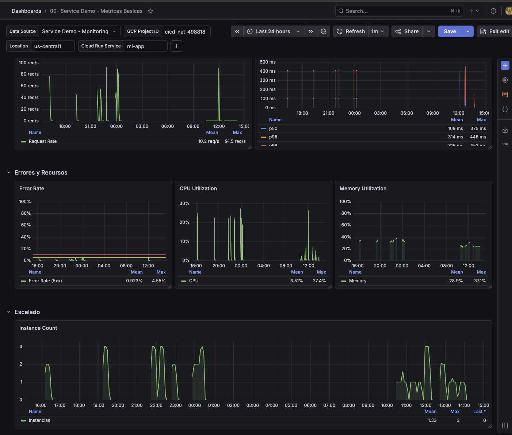
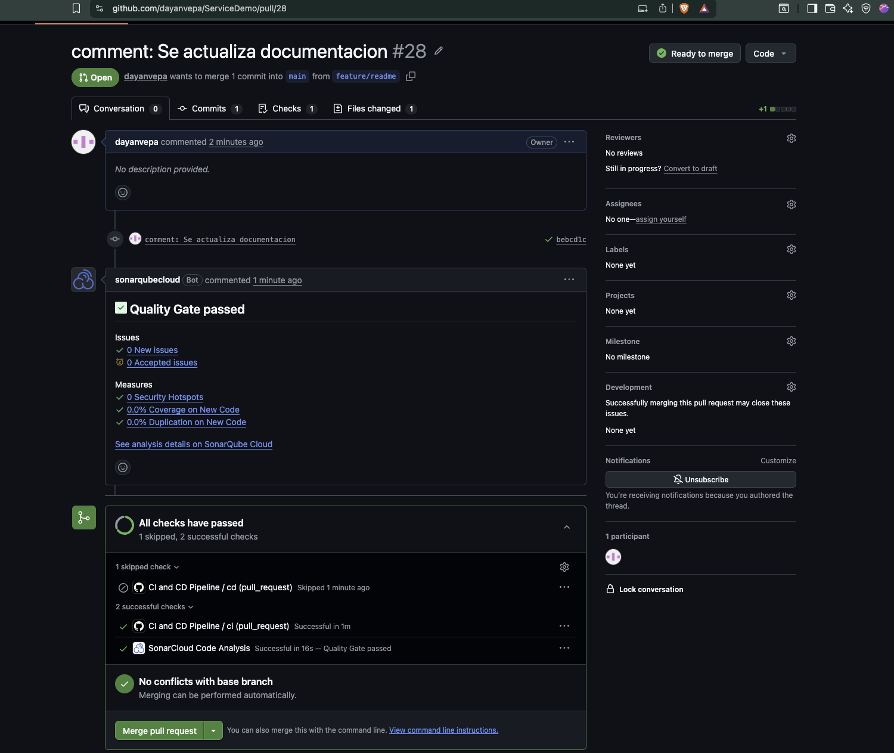
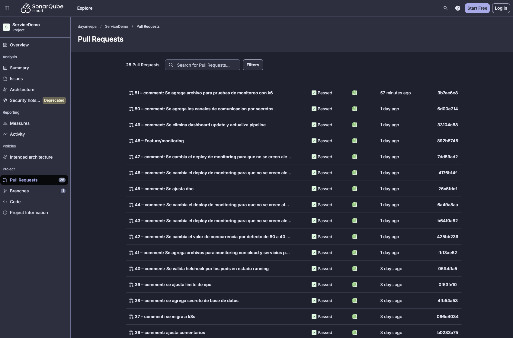

#  ServiceDemo — CI/CD Pipeline

<div align="center">


[](https://sonarcloud.io/summary/new_code?id=dayanvepa_ServiceDemo)
[](https://sonarcloud.io/summary/new_code?id=dayanvepa_ServiceDemo)
[](https://sonarcloud.io/summary/new_code?id=dayanvepa_ServiceDemo)
[](https://sonarcloud.io/summary/new_code?id=dayanvepa_ServiceDemo)
[](https://sonarcloud.io/summary/new_code?id=dayanvepa_ServiceDemo)

**API REST construida con .NET 9, desplegada automáticamente en Google Cloud Run mediante GitHub Actions.**

[🌐 Ver API en producción](https://mi-app-omaolvi2za-uc.a.run.app/scalar/v1) · [📊 Ver en SonarCloud](https://sonarcloud.io/summary/new_code?id=dayanvepa_ServiceDemo)

</div>

---
## Integrantes del Equipo

| Nombre | GitHub |
|---|---|
| **Dayan Velasquez Parrado** | [@dayanvepa](https://github.com/dayanvepa) |
| **Anuar Edilson Vargas Calderon** |  [@anuarvargascal](https://github.com/anuarvargascal) |

---

## Tabla de Contenidos

- [Descripción general](#-descripción-general)
- [Arquitectura del proyecto](#-arquitectura-del-proyecto)
- [Tecnologías utilizadas](#-tecnologías-utilizadas)
- [Flujo del pipeline CI/CD](#-flujo-del-pipeline-cicd)
- [Prerrequisitos en GCP](#-prerrequisitos-en-gcp)
- [Configuración de GitHub Secrets y Variables](#-configuración-de-github-secrets-y-variables)
- [Pipeline CI — Paso a paso](#-pipeline-ci--paso-a-paso)
- [Pipeline CD — Paso a paso](#-pipeline-cd--paso-a-paso)
- [Seguridad del pipeline](#-seguridad-del-pipeline)
- [Monitoreo y Observabilidad](#-monitoreo-y-observabilidad)
- [Análisis de calidad con SonarCloud](#-análisis-de-calidad-con-sonarcloud)
- [Dockerfile](#-dockerfile)
- [Reflexión sobre Eficiencia Operativa](#-reflexión-sobre-eficiencia-operativa)
- [Endpoints del servicio](#-endpoints-del-servicio)
- [Referencias](#-referencias)

---

##  Descripción general

**ServiceDemo** es una API REST desarrollada con **.NET 9** que implementa un flujo completo de **DevSecOps** con:

- ✅ Integración continua con análisis de calidad y cobertura de código (**SonarCloud**)
- ✅ Escaneo de vulnerabilidades en imagen Docker (**Trivy**)
- ✅ Despliegue continuo en **Google Cloud Run** con versionamiento semántico
- ✅ Rollback automático ante fallos en el health check
- ✅ Autenticación segura con **Workload Identity Federation** (sin llaves JSON)
- ✅ Gestión de secretos con **Google Secret Manager**
- ✅ Imágenes Docker almacenadas en **Artifact Registry**
- ✅ Monitoreo y alertas con **Cloud Monitoring** + **Grafana**

---

## Arquitectura del proyecto

```text
ServiceDemo/
├── .github/
│   └── workflows/
│       └── ci-cd.yaml              # Pipeline CI/CD completo
├── src/
│   ├── ServiceDemo.API/            # Controllers, Middleware, Program.cs
│   ├── ServiceDemo.Application/    # Services, Validators, DTOs, Mappings
│   ├── ServiceDemo.Domain/         # Entidades, Interfaces, Excepciones
│   └── ServiceDemo.Infrastructure/ # Repositorios, DbContext, UnitOfWork
├── tests/
│   └── ServiceDemo.Tests/          # Pruebas unitarias (xUnit)
├── Dockerfile                      # Multi-stage build optimizado
└── ServiceDemo.slnx                # Archivo de solución .NET
```

### Capas de la arquitectura

| Capa | Proyecto | Responsabilidad |
|---|---|---|
| **API** | `ServiceDemo.API` | Exposición de endpoints REST, middleware, configuración |
| **Application** | `ServiceDemo.Application` | Lógica de negocio, validaciones, DTOs, AutoMapper |
| **Domain** | `ServiceDemo.Domain` | Entidades, interfaces de repositorios, excepciones |
| **Infrastructure** | `ServiceDemo.Infrastructure` | Implementación de repositorios, EF Core, UnitOfWork |

---

##  Tecnologías utilizadas

### Backend

| Tecnología | Versión | Uso |
|---|---|---|
| .NET / ASP.NET Core | 9.0 | Framework principal |
| Entity Framework Core | Latest | ORM para acceso a datos |
| FluentValidation | Latest | Validación de modelos |
| AutoMapper | Latest | Mapeo entre capas |
| Scalar | Latest | Documentación interactiva de la API |
| xUnit | Latest | Framework de pruebas unitarias |

### DevSecOps y Calidad

| Herramienta | Uso |
|---|---|
| GitHub Actions | Orquestación del pipeline CI/CD |
| SonarCloud | Análisis estático, cobertura y Quality Gate |
| Trivy | Escaneo de vulnerabilidades en imagen Docker |
| Docker | Contenedorización multi-stage de la aplicación |

### Google Cloud Platform

| Servicio | Uso |
|---|---|
| Cloud Run | Hosting serverless de contenedores |
| Artifact Registry | Repositorio de imágenes Docker |
| Secret Manager | Gestión segura de secretos |
| Workload Identity Federation | Autenticación keyless desde GitHub |
| Cloud Monitoring | Métricas, dashboards y alertas nativas |
| Cloud SQL (PostgreSQL 15) | Persistencia de Grafana |
| IAM | Control de acceso y permisos |

### Monitoreo y Observabilidad

| Herramienta | Uso |
|---|---|
| Cloud Monitoring | Recolección automática de métricas de Cloud Run |
| Grafana | Visualización avanzada de métricas y dashboards |
| Cloud SQL PostgreSQL | Persistencia de dashboards y configuración de Grafana |

---

## 🔄 Flujo del pipeline CI/CD

```text
┌─────────────────────────────────────────────────────────────────┐
│                        DEVELOPER                                │
│              git push main  /  git tag v*.*.*                   │
└──────────────────────────┬──────────────────────────────────────┘
                           │
                           ▼
┌─────────────────────────────────────────────────────────────────┐
│                     JOB: CI                                     │
│                                                                 │
│  Checkout (fetch-depth:0)                                       │
│       ↓                                                         │
│  Setup .NET 9                                                   │
│       ↓                                                         │
│  SonarCloud Begin ──────────────────────────────────┐           │
│       ↓                                             │           │
│  Restore → Build (Release) → Tests + Coverage       │           │
│       ↓                                             │           │
│  SonarCloud End ◄───────────────────────────────────┘           │
│       └── Quality Gate ✅ / ❌ (bloquea si falla)               │
│       ↓                                                         │
│  Google Auth (Workload Identity Federation)                     │
│       ↓                                                         │
│  Calcular versión:                                              │
│    tag v1.2.3 → "1.2.3" + publica :latest                       │
│    push SHA   → "${{ github.sha }}"                             │
│       ↓                                                         │
│  Docker Build (local, sin push aún)                             │
│       ↓                                                         │
│  Trivy Scan (CRITICAL + HIGH, --ignore-unfixed)                 │
│       └── Si encuentra CVEs → ❌ Pipeline falla, NO se sube     │
│       ↓                                                         │
│  Push → Artifact Registry                                       │
└──────────────────────────┬──────────────────────────────────────┘
                           │ (solo si CI exitoso + push a main/tag)
                           ▼
┌─────────────────────────────────────────────────────────────────┐
│                     JOB: CD                                     │
│                                                                 │
│  Google Auth (WIF)                                              │
│       ↓                                                         │
│  Obtener revisión activa (para rollback)                        │
│       ↓                                                         │
│  Deploy → Cloud Run (imagen + Secret Manager)                   │
│       ↓                                                         │
│  Health Check GET /health (5 intentos × 10s)                    │
│       ├── ✅ OK → Deploy Monitoring (Dashboards + Alertas)      │
│       └── ❌ Falla → Rollback automático a revisión anterior    │
└──────────────────────────┬──────────────────────────────────────┘
                           │
                           ▼
┌─────────────────────────────────────────────────────────────────┐
│                   GCP INFRASTRUCTURE                            │
│                                                                 │
│  Artifact Registry ──► Cloud Run (mi-app)                       │
│                              │                                  │
│                        Secret Manager                           │
│                              │                                  │
│                        Cloud Monitoring ──► Alertas             │
│                              │                                  │
│                        Grafana (Cloud Run)                      │
│                        + Cloud SQL PostgreSQL                   │
└─────────────────────────────────────────────────────────────────┘
```

### Triggers del pipeline

| Evento | Comportamiento |
|--------|----------------|
| `push` a `main` | CI completo + CD con tag SHA |
| `push` de tag `v*.*.*` | CI completo + CD con versión semántica + publica `:latest` |
| `pull_request` a `main` | Solo CI (build, tests, SonarCloud) — sin deploy |

---

##  Prerrequisitos en GCP

### 1. Habilitar servicios necesarios

```bash
gcloud services enable run.googleapis.com \
  artifactregistry.googleapis.com \
  iam.googleapis.com \
  iamcredentials.googleapis.com \
  secretmanager.googleapis.com \
  sqladmin.googleapis.com \
  monitoring.googleapis.com
```

### 2. Crear el Service Account

```bash
gcloud iam service-accounts create github-actions-sa \
  --display-name="GitHub Actions SA" \
  --project=cicd-net-498818
```

### 3. Asignar roles al Service Account

```bash
# Administrar servicios en Cloud Run
gcloud projects add-iam-policy-binding cicd-net-498818 \
  --member="serviceAccount:github-actions-sa@cicd-net-498818.iam.gserviceaccount.com" \
  --role="roles/run.admin"

# Publicar imágenes en Artifact Registry
gcloud projects add-iam-policy-binding cicd-net-498818 \
  --member="serviceAccount:github-actions-sa@cicd-net-498818.iam.gserviceaccount.com" \
  --role="roles/artifactregistry.writer"

# Actuar como service account
gcloud projects add-iam-policy-binding cicd-net-498818 \
  --member="serviceAccount:github-actions-sa@cicd-net-498818.iam.gserviceaccount.com" \
  --role="roles/iam.serviceAccountUser"
```

### 4. Configurar Workload Identity Federation

```bash
# Crear el pool
gcloud iam workload-identity-pools create "github-pool" \
  --project="cicd-net-498818" \
  --location="global" \
  --display-name="GitHub Pool"

# Crear el provider OIDC
gcloud iam workload-identity-pools providers create-oidc "github-provider" \
  --project="cicd-net-498818" \
  --location="global" \
  --workload-identity-pool="github-pool" \
  --display-name="GitHub Provider" \
  --attribute-mapping="google.subject=assertion.sub,attribute.repository=assertion.repository,attribute.actor=assertion.actor" \
  --issuer-uri="https://token.actions.githubusercontent.com" \
  --attribute-condition="assertion.repository=='dayanvepa/ServiceDemo'"

# Vincular el Service Account al pool
gcloud iam service-accounts add-iam-policy-binding \
  github-actions-sa@cicd-net-498818.iam.gserviceaccount.com \
  --project="cicd-net-498818" \
  --role="roles/iam.workloadIdentityUser" \
  --member="principalSet://iam.googleapis.com/projects/802338067803/locations/global/workloadIdentityPools/github-pool/attribute.repository/dayanvepa/ServiceDemo"
```

### 5. Crear repositorio en Artifact Registry

```bash
gcloud artifacts repositories create mi-app \
  --repository-format=docker \
  --location=us-central1 \
  --description="Docker images for ServiceDemo"
```

### 6. Crear el secret de la cadena de conexión

```bash
echo -n "Server=tcp:<servidor>,1433;Initial Catalog=<db>;..." | \
  gcloud secrets create connection-string --data-file=- --project=cicd-net-498818
```

### 7. Obtener el valor de WIF_PROVIDER

```bash
gcloud iam workload-identity-pools providers describe github-provider \
  --project="cicd-net-498818" \
  --location="global" \
  --workload-identity-pool="github-pool" \
  --format="value(name)"
```

---

## Configuración de GitHub Secrets y Variables

Ve a tu repositorio → **Settings → Secrets and variables → Actions**

### Secrets

| Nombre | Descripción | Valor |
|---|---|---|
| `GCP_PROJECT_ID` | ID del proyecto GCP | `cicd-net-498818` |
| `WIF_PROVIDER` | Ruta completa del provider WIF | Resultado del comando anterior |
| `WIF_SERVICE_ACCOUNT` | Email del service account | `github-actions-sa@cicd-net-498818.iam.gserviceaccount.com` |
| `SONAR_TOKEN` | Token de SonarCloud | SonarCloud → My Account → Security |

### Variables (no sensibles)

| Nombre | Descripción | Valor |
|---|---|---|
| `SONAR_PROJECT_KEY` | Clave del proyecto en SonarCloud | `dayanvepa_ServiceDemo` |
| `SONAR_ORGANIZATION` | Organización en SonarCloud | `lego1300` |

>  **Importante:** Los secrets se configuran en **Secrets** y las variables no sensibles en **Variables**. No los confundas.

---

##  Pipeline CI — Paso a paso

### 1. Checkout del código

```yaml
- name: Checkout
  uses: actions/checkout@v4
  with:
    fetch-depth: 0  # Requerido por SonarCloud para analizar el historial completo
```

### 2. SonarCloud — Análisis estático

```yaml
- name: Begin Sonar Analysis
  if: ${{ !startsWith(github.ref, 'refs/tags/') }}
  run: |
    dotnet sonarscanner begin \
      /k:"${{ env.SONAR_PROJECT_KEY }}" \
      /o:"${{ env.SONAR_ORGANIZATION }}" \
      /d:sonar.token="${{ env.SONAR_TOKEN }}" \
      /d:sonar.host.url="https://sonarcloud.io" \
      /d:sonar.qualitygate.wait=true \
      /d:sonar.cs.opencover.reportsPaths="./TestResults/coverage/coverage.opencover.xml" \
      /d:sonar.exclusions="**/Migrations/**,**/obj/**,**/bin/**,**/Program.cs,**/DependencyInjection.cs,src/ServiceDemo.Domain/**,src/ServiceDemo.Infrastructure/Data/ServiceDemoDbContext.cs,src/ServiceDemo.Application/Mappings/**" \
      /d:sonar.coverage.exclusions="**/Program.cs,**/DependencyInjection.cs,src/ServiceDemo.Domain/**,src/ServiceDemo.Infrastructure/**,src/ServiceDemo.API/**,src/ServiceDemo.Application/Validators/**,src/ServiceDemo.Application/Common/**"
```

### 3. Build y Tests con cobertura

```yaml
- name: Compilar Solución
  run: dotnet build ServiceDemo.slnx --no-restore --configuration Release

- name: Run Tests with Coverage
  run: |
    dotnet test ServiceDemo.slnx \
      --no-build \
      --configuration Release \
      --collect:"XPlat Code Coverage" \
      --results-directory ./TestResults \
      -- DataCollectionRunSettings.DataCollectors.DataCollector.Configuration.Format=opencover
```

### 4. Trivy — Escaneo de vulnerabilidades

```yaml
- name: Build Docker image (local, sin push)
  run: docker build -t local_image_to_scan:$VERSION .

- name: Scan Docker image with Trivy
  run: |
    trivy image \
      --severity CRITICAL,HIGH \
      --ignore-unfixed \
      --scanners vuln \
      --exit-code 1 \
      --format table \
      local_image_to_scan:$VERSION
```

> ✅ Si Trivy detecta vulnerabilidades CRITICAL o HIGH con fix disponible, el pipeline **falla aquí** y la imagen **no se publica** en Artifact Registry.

### 5. Versionamiento semántico y Push

```yaml
- name: Calcular versión semántica
  id: version
  run: |
    if [[ "${{ github.ref }}" == refs/tags/v* ]]; then
      VERSION="${{ github.ref_name }}"
      VERSION="${VERSION#v}"
      IS_RELEASE="true"
    else
      VERSION="${{ github.sha }}"
      IS_RELEASE="false"
    fi
    echo "version=$VERSION" >> $GITHUB_OUTPUT
    echo "is_release=$IS_RELEASE" >> $GITHUB_OUTPUT

- name: Build and Push Container
  run: |
    BASE_URL="${{ env.REGION }}-docker.pkg.dev/${{ env.PROJECT_ID }}/${{ env.REPOSITORY }}/${{ env.SERVICE_NAME }}"
    docker build -t $BASE_URL:$VERSION .
    docker push $BASE_URL:$VERSION
    # Si es release semántico, también publicar como :latest
    if [ "$IS_RELEASE" = "true" ]; then
      docker tag $BASE_URL:$VERSION $BASE_URL:latest
      docker push $BASE_URL:latest
    fi
```

---

##  Pipeline CD — Paso a paso

### Condición de ejecución

```yaml
cd:
  needs: ci
  if: github.event_name == 'push' && (github.ref == 'refs/heads/main' || startsWith(github.ref, 'refs/tags/v'))
```

El job `cd` solo se ejecuta si:
- El job `ci` finalizó con éxito ✅
- El evento es un `push` a `main` o un tag `v*.*.*`

### Deploy con rollback automático

```yaml
# 1. Guardar revisión activa antes de desplegar
- name: Obtener revisión activa actual
  id: current_revision
  run: |
    REVISION=$(gcloud run services describe ${{ env.SERVICE_NAME }} \
      --region=${{ env.REGION }} \
      --format="value(status.traffic[0].revisionName)" 2>/dev/null || echo "")
    echo "revision=$REVISION" >> $GITHUB_OUTPUT

# 2. Desplegar nueva versión
- name: Deploy to Cloud Run
  uses: google-github-actions/deploy-cloudrun@v2
  with:
    service: ${{ env.SERVICE_NAME }}
    region: ${{ env.REGION }}
    image: "${{ env.REGION }}-docker.pkg.dev/${{ env.PROJECT_ID }}/${{ env.REPOSITORY }}/${{ env.SERVICE_NAME }}:${{ steps.version.outputs.version }}"
    flags: '--allow-unauthenticated --concurrency=40'
    secrets: |
      ConnectionStrings__DefaultConnection=connection-string:latest

# 3. Health check (5 intentos × 10s)
- name: Verificar salud del deploy
  run: |
    for i in {1..5}; do
      STATUS=$(curl -s -o /dev/null -w "%{http_code}" "$SERVICE_URL/health")
      if [ "$STATUS" = "200" ]; then exit 0; fi
      sleep 10
    done
    exit 1

# 4. Rollback si falla
- name: Rollback automático si falla
  if: failure() && steps.current_revision.outputs.revision != ''
  run: |
    gcloud run services update-traffic ${{ env.SERVICE_NAME }} \
      --region=${{ env.REGION }} \
      --to-revisions=${{ steps.current_revision.outputs.revision }}=100
```

---

## 🔒 Seguridad del pipeline

### Workload Identity Federation (Keyless Auth)

En lugar de almacenar un archivo JSON de service account en GitHub, se usa **Workload Identity Federation**:

```text
GitHub Actions emite token OIDC
         │
         ▼
GCP valida que el token viene de dayanvepa/ServiceDemo
         │
         ▼
GCP otorga acceso temporal al Service Account
         │
         ▼
Pipeline ejecuta gcloud / docker sin credenciales estáticas
```

### Trivy — Escaneo de vulnerabilidades en imagen Docker

| Parámetro | Valor | Descripción |
|---|---|---|
| `--severity` | `CRITICAL,HIGH` | Solo reporta severidades altas |
| `--ignore-unfixed` | — | Ignora CVEs sin parche disponible |
| `--exit-code 1` | — | Falla el pipeline si encuentra CVEs |
| `--scanners vuln` | — | Escanea OS + dependencias de la imagen |


### Secret Manager

La cadena de conexión **nunca** se almacena como variable de entorno plana. Se gestiona en Secret Manager y se inyecta en tiempo de ejecución en Cloud Run:

```bash
# Ver secretos asignados al servicio
gcloud run services describe mi-app \
  --region us-central1 \
  --format="value(spec.template.spec.containers[0].env)"
```
###  Evidencia — Reporte vulnerabilidades de `Trivy`

<div align="center">
  
</div>

###  Evidencia — Reporte actual de `Trivy`

<div align="center">
  
</div>

---

## 📊 Monitoreo y Observabilidad


### Cloud Monitoring — Dashboards y Alertas

El pipeline despliega automáticamente recursos de monitoreo en cada ejecución exitosa:

| Recurso | Descripción |
|---|---|
| Dashboard principal | Métricas de Cloud Run para `mi-app` |
| `alert-errors.json` | Alerta por tasa de errores HTTP 5xx elevada |
| `alert-latency.json` | Alerta por latencia p99 sobre umbral |
| `alert-availability.json` | Alerta por caída de disponibilidad del servicio |

###  Evidencia — Cloud Monitoring

<table style="width:100%;  border-collapse:collapse;">
  <tr>
    <td style="width:50%; border:1px solid #ccc;">
      
    </td>
    <td style="width:50%; border:1px solid #ccc;">
      
    </td>
  </tr>
  <tr>
    <td style="width:50%; border:1px solid #ccc;">
      
    </td>
    <td style="width:50%; border:1px solid #ccc;">
      
    </td>
  </tr>
</table>


### Grafana — Visualización avanzada

Grafana está desplegado en Cloud Run con persistencia en **Cloud SQL PostgreSQL 15**, garantizando que los dashboards sobrevivan reinicios del contenedor.

> Se optó por utilizar las métricas nativas de Google Cloud Monitoring API para reducir la complejidad operativa y aprovechar la observabilidad integrada de Cloud Run. Esto elimina la necesidad de gestionar infraestructura adicional de Prometheus y garantiza una integración directa con el servicio de Grafana desplegado.

| Componente | Detalle |
|---|---|
| Servicio | `grafana-service` en Cloud Run |
| Persistencia | Cloud SQL PostgreSQL 15 (`grafana-db-instance`) |
| Service Account | `grafana-monitoring@cicd-net-498818.iam.gserviceaccount.com` |
| Data Source | Google Cloud Monitoring |
| Rol IAM | `roles/monitoring.viewer` |

#### Métricas visualizadas

| Panel | Métrica GCP | Descripción |
|---|---|---|
| Request Rate | `run.googleapis.com/request_count` | Requests por segundo |
| Latencia p50/p95/p99 | `run.googleapis.com/request_latencies` | Distribución de tiempos de respuesta |
| Error Rate | `run.googleapis.com/request_count` (5xx) | Tasa de errores |
| CPU Utilization | `run.googleapis.com/container/cpu/utilizations` | Uso de CPU por instancia |
| Memory Utilization | `run.googleapis.com/container/memory/utilizations` | Uso de memoria |
| Instance Count | `run.googleapis.com/container/instance_count` | Instancias activas (escala automática) |

#### Paso a Paso Instalacion de Grafana 
##### Paso 1 — Crear la instancia de Cloud SQL (PostgreSQL 15)

```bash
gcloud sql instances create grafana-db-instance \
    --database-version=POSTGRES_15 \
    --tier=db-f1-micro \
    --region=us-central1 \
    --project=cicd-net-498818
```

**Resultado:**

```
NAME                 DATABASE_VERSION  LOCATION       TIER         PRIMARY_ADDRESS  STATUS
grafana-db-instance  POSTGRES_15       us-central1-c  db-f1-micro  34.31.103.228    RUNNABLE
```

##### Paso 2 — Crear la base de datos y el usuario

```bash
gcloud sql databases create grafana_db --instance=grafana-db-instance
gcloud sql users create grafana_user --instance=grafana-db-instance --password=<PASSWORD>
```

##### Paso 3 — Crear la Service Account para Grafana
Grafana necesita una identidad propia para autenticarse con Google Cloud Monitoring API y leer las métricas de Cloud Run.

- Crear la Service Account
```bash
gcloud iam service-accounts create grafana-monitoring \
  --display-name="Grafana Monitoring SA" \
  --project=cicd-net-498818
  ```

- Asignar permiso de solo lectura de métricas
```bash 
gcloud projects add-iam-policy-binding cicd-net-498818 \
  --member="serviceAccount:grafana-monitoring@cicd-net-498818.iam.gserviceaccount.com" \
  --role="roles/monitoring.viewer"
```
##### Paso 4 — Desplegar Grafana en Cloud Run

```bash
gcloud run deploy grafana-service \
  --image=grafana/grafana:latest \
  --region=us-central1 \
  --project=cicd-net-498818 \
  --allow-unauthenticated \
  --port=3000 \
  --set-env-vars="GF_DATABASE_TYPE=postgres,\
GF_DATABASE_HOST=/cloudsql/cicd-net-498818:us-central1:grafana-db-instance,\
GF_DATABASE_NAME=grafana_db,\
GF_DATABASE_USER=grafana_user,\
GF_DATABASE_PASSWORD=<PASSWORD>,\
GF_AUTH_ANONYMOUS_ENABLED=true,\
GF_AUTH_ANONYMOUS_ORG_ROLE=Admin" \
  --add-cloudsql-instances=cicd-net-498818:us-central1:grafana-db-instance \
  --service-account=grafana-monitoring@cicd-net-498818.iam.gserviceaccount.com
```
> ***Nota:*** El parámetro --service-account vincula la instancia de Grafana con la identidad creada en el Paso 3, garantizando que el Data Source de Google Cloud Monitoring tenga los permisos necesarios para consumir métricas de Cloud Run.


#### Evidencia — Resultados del Dashboard de Grafana tras la prueba de carga con K6

<div align="center">
  
</div>

#### Evidencia — Resultados del Dashboard de Grafana ultimas 24h

<div align="center">
  
</div>

**URL base grafana:**

```
https://grafana-service-802338067803.us-central1.run.app/
```


---

## 📊 Análisis de calidad con SonarCloud

### Exclusiones configuradas

#### `sonar.exclusions` — Excluye completamente del análisis

| Patrón | Razón |
|---|---|
| `**/Migrations/**` | Código generado por Entity Framework |
| `**/obj/**`, `**/bin/**` | Artefactos de compilación |
| `**/Program.cs` | Punto de entrada, sin lógica de negocio |
| `**/DependencyInjection.cs` | Solo registro de servicios |
| `src/ServiceDemo.Domain/**` | Entidades y POCOs sin lógica |
| `ServiceDemoDbContext.cs` | Configuración de EF Core |
| `src/ServiceDemo.Application/Mappings/**` | Perfiles de AutoMapper |

#### `sonar.coverage.exclusions` — Excluye solo del cálculo de cobertura

| Patrón | Razón |
|---|---|
| `src/ServiceDemo.Infrastructure/**` | Requiere DB real o mocks complejos |
| `src/ServiceDemo.API/**` | Requiere integration tests |
| `src/ServiceDemo.Application/Validators/**` | Validaciones de FluentValidation |
| `src/ServiceDemo.Application/Common/**` | Clases de utilidad |

### Diferencia clave

```text
sonar.exclusions          → El archivo NO aparece en SonarCloud
sonar.coverage.exclusions → El archivo SÍ aparece, pero NO cuenta en el % de cobertura
```


###  Evidencia — Scaneo de Sonarqube PullRequest

<div align="center">
  
</div>

###  Evidencia — Scaneo de Sonarqube 

<div align="center">
  
</div>


---

## 🐳 Dockerfile

El proyecto usa un **multi-stage build** para optimizar el tamaño de la imagen final:

```dockerfile
# ── Etapa 1: Build ────────────────────────────────────────────────
FROM mcr.microsoft.com/dotnet/sdk:9.0 AS build
WORKDIR /app

COPY ServiceDemo.slnx ./
COPY src/ServiceDemo.Domain/ServiceDemo.Domain.csproj             src/ServiceDemo.Domain/
COPY src/ServiceDemo.Application/ServiceDemo.Application.csproj   src/ServiceDemo.Application/
COPY src/ServiceDemo.Infrastructure/ServiceDemo.Infrastructure.csproj src/ServiceDemo.Infrastructure/
COPY src/ServiceDemo.API/ServiceDemo.API.csproj                   src/ServiceDemo.API/

RUN dotnet restore src/ServiceDemo.API/ServiceDemo.API.csproj

COPY src/ src/

RUN dotnet publish src/ServiceDemo.API/ServiceDemo.API.csproj \
    -c Release \
    -o /app/publish

# ── Etapa 2: Runtime ──────────────────────────────────────────────
FROM mcr.microsoft.com/dotnet/aspnet:9.0 AS runtime
WORKDIR /app

ENV ASPNETCORE_URLS=http://0.0.0.0:8080
ENV ASPNETCORE_HTTP_PORTS=8080

COPY --from=build /app/publish .

EXPOSE 8080

ENTRYPOINT ["dotnet", "ServiceDemo.API.dll"]
```

| Etapa | Imagen base | Tamaño aproximado |
|---|---|---|
| Build | `dotnet/sdk:9.0` | ~900 MB |
| Runtime (final) | `dotnet/aspnet:9.0` | ~220 MB |

>  Cloud Run requiere que la aplicación escuche en el puerto `8080`. Las variables `ASPNETCORE_URLS` y `ASPNETCORE_HTTP_PORTS` garantizan esto explícitamente.

---
## Reflexión sobre Eficiencia Operativa

La implementación de este pipeline CI/CD representó un cambio fundamental en la forma de entregar software: pasar de un proceso manual, propenso a errores y dependiente de intervención humana, a un flujo completamente automatizado que garantiza calidad, seguridad y disponibilidad en cada despliegue.

### Automatización y velocidad de entrega

Antes de implementar el pipeline, cada despliegue requería ejecutar manualmente los tests, construir la imagen Docker, subirla a un registro y actualizar el servicio en GCP. Con GitHub Actions, todo este proceso ocurre automáticamente en respuesta a un git push, reduciendo el tiempo de entrega de horas a minutos y eliminando la posibilidad de omitir pasos críticos por error humano.

### Seguridad integrada desde el inicio (DevSecOps)

La integración de SonarCloud y Trivy directamente en el pipeline convierte la seguridad en una parte no negociable del proceso de desarrollo. Ninguna imagen con vulnerabilidades CRITICAL o HIGH con fix disponible puede llegar a producción, ya que el pipeline falla automáticamente antes del push a Artifact Registry. Esto implementa el principio de "shift left security": detectar problemas lo más temprano posible en el ciclo de vida, cuando son más baratos y fáciles de corregir.

### Resiliencia operativa

El mecanismo de rollback automático implementado en el Job CD garantiza que un despliegue fallido no deje el servicio caído. Si el health check no obtiene respuesta HTTP 200 en cinco intentos, el tráfico se restaura automáticamente a la revisión anterior de Cloud Run. Esto reduce el tiempo de recuperación ante fallos (MTTR) sin intervención manual.

### Observabilidad

La combinación de Cloud Monitoring y Grafana proporciona visibilidad completa del comportamiento del servicio en producción. Las alertas automáticas permiten detectar degradaciones de rendimiento o errores antes de que los usuarios los reporten. Grafana, desplegado con persistencia en Cloud SQL, garantiza que los dashboards estén siempre disponibles y actualizados.

### Versionamiento semántico

La estrategia de versiones implementada (SHA para commits de desarrollo, vX.Y.Z para releases) permite trazabilidad completa: en cualquier momento es posible identificar exactamente qué versión del código está corriendo en producción y reproducir el entorno exacto de cualquier despliegue anterior.

### Lecciones aprendidas
- La autenticación mediante Workload Identity Federation elimina la necesidad de gestionar claves de servicio estáticas, reduciendo significativamente la superficie de ataque en el pipeline.
- El uso de Secret Manager para inyectar la cadena de conexión en tiempo de ejecución garantiza que las credenciales nunca estén en el código ni en los logs del pipeline.
- Separar el build local del push al registro, con el escaneo de Trivy en medio, es una práctica que evita publicar imágenes inseguras incluso si el escaneo falla inesperadamente.

---

## 🌐 Endpoints del servicio

| Endpoint | Descripción |
|---|---|
| `/scalar/v1` | Documentación interactiva (Scalar UI) |
| `/health` | Health check del servicio |

**URL base :**

```
https://mi-app-omaolvi2za-uc.a.run.app/
```

---
##  Referencias

*   [GitHub Actions Documentation](https://docs.github.com/en/actions) - Guía oficial para la automatización de flujos de trabajo.
*   [SonarCloud Documentation](https://docs.sonarcloud.io/) - Documentación para el análisis de calidad de código y Quality Gates.
*   [Trivy Documentation](https://aquasecurity.github.io/trivy/) - Guía de escaneo de vulnerabilidades en contenedores y dependencias.
*   [Google Cloud Run Documentation](https://cloud.google.com/run/docs) - Guías sobre despliegue, escalado y gestión de revisiones.
*   [Google Cloud Monitoring](https://cloud.google.com/monitoring/docs) - Documentación para la recolección de métricas, creación de dashboards y alertas.
*   [Grafana Documentation](https://grafana.com/docs/) - Guía de visualización de datos y configuración de data sources.
*   [Workload Identity Federation](https://cloud.google.com/iam/docs/workload-identity-federation) - Documentación sobre autenticación segura entre GitHub y GCP sin llaves de servicio.

---

<div align="center">

Desarrollado con  usando .NET 9, GitHub Actions y Google Cloud Platform  
**Laboratorio 2 — DevOps | 2026**

</div>